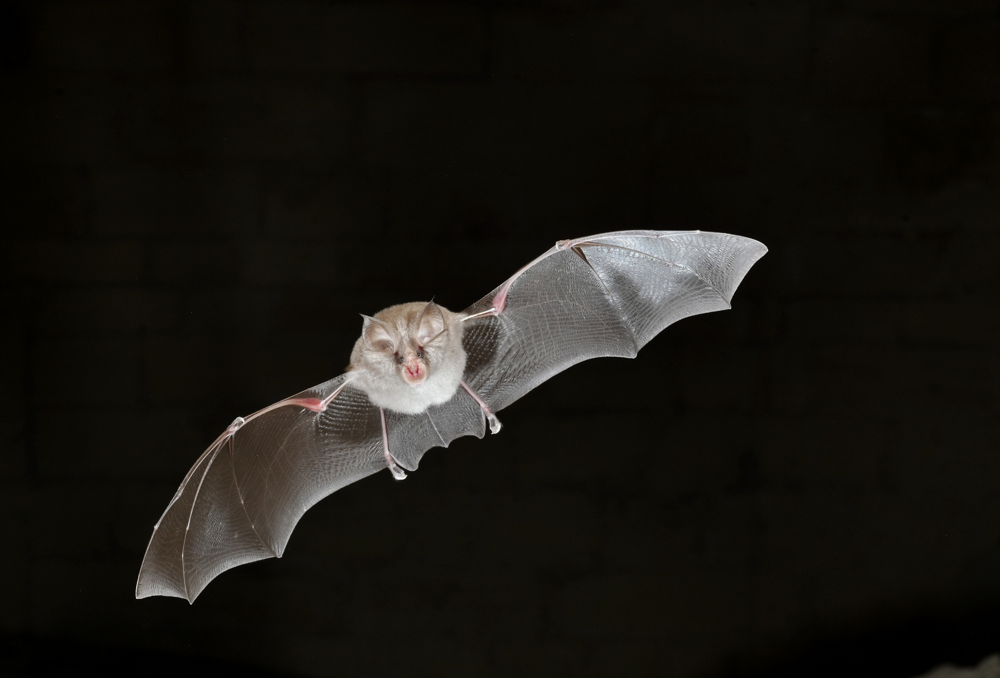

# Artificial light at night disrupts gene expression and influences evolutionary change in bats

This repository contains the code and supporting data used in this study.

**Reference**  
TBC

**Species studied**
- _Rhinolophus hipposideros_

 

Image credit: Daniel Whitby
